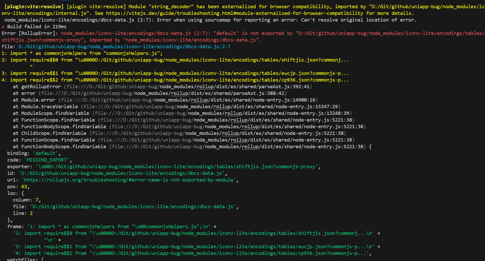

# uniapp-bug

当前版本的uniapp脚手架项目存在一个BUG，导致项目编译失败。

## 错误信息

## 项目来源

项目源码基础来源于官方提供的脚手架项目。

地址：[https://zh.uniapp.dcloud.io/quickstart-cli.html#%E5%88%9B%E5%BB%BAuni-app](https://zh.uniapp.dcloud.io/quickstart-cli.html#%E5%88%9B%E5%BB%BAuni-app)

## 项目源码与基础源码的差异

增加了iconv-lite依赖，修改了 [src/pages/index/index.vue](./src/pages/index/index.vue)。

## 复现步骤

- 克隆项目到本地，安装依赖
- 运行构建命令，例如 `yarn build:h5` 、 `yarn build:app` 等。
- 经过一段时间后，构建失败，展示错误信息

## 临时的解决办法

修改 [package.json文件](./package.json)内`dependencies`的 `@dcloudio/vite-plugin-uni`版本号，将其由`3.0.0-4020820240925001`修改为上个版本 `3.0.0-4020420240722003`，构建成功。
