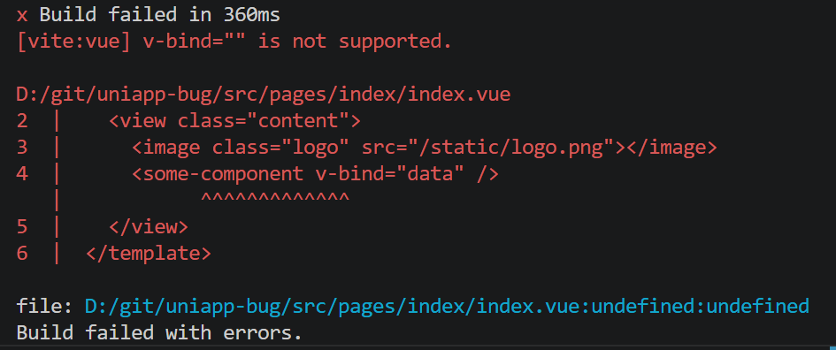

# mp-weixin-bind-bug

编译到微信平台时无法识别v-bind指令。

## 项目来源

项目源码基础来源于官方提供的脚手架项目。

地址：[https://zh.uniapp.dcloud.io/quickstart-cli.html#%E5%88%9B%E5%BB%BAuni-app](https://zh.uniapp.dcloud.io/quickstart-cli.html#%E5%88%9B%E5%BB%BAuni-app)

## 项目安装

```bash
yarn install
```

## 操作步骤

运行编译到微信平台的编译指令。
```bash
yarn run build:mp-weixin
```

## 错误截图



## 额外说明

回退uniapp相关依赖的版本值至上个版本3.0.0-5000520260324001可暂时解决此问题。
